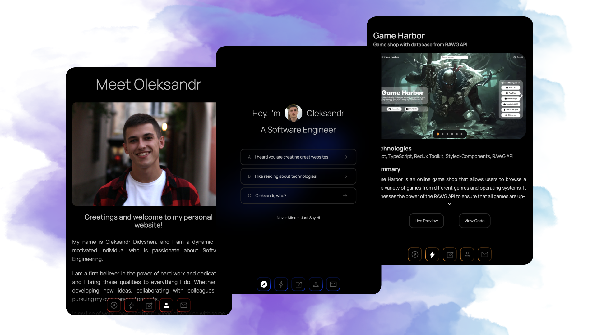
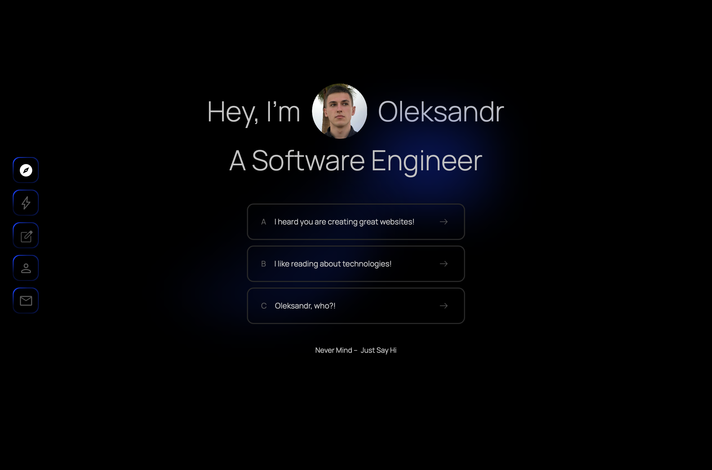
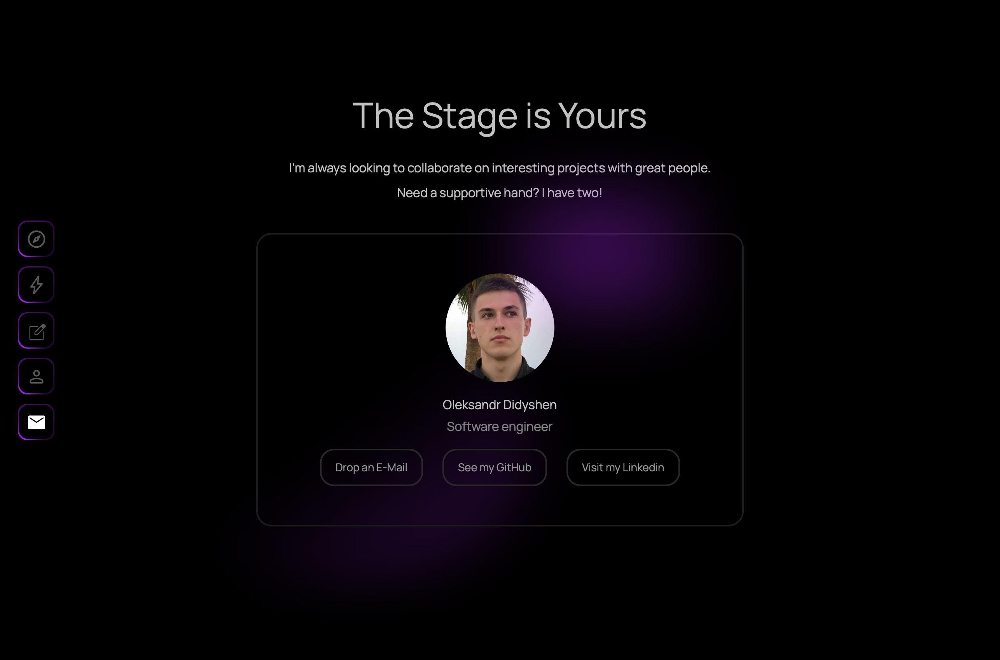
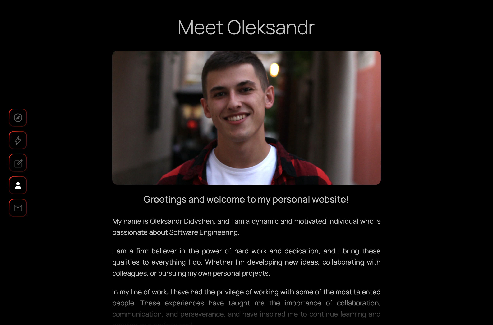

<h1 align='center'>Portfolio</h1>



## Demo

🔥 [Live Demo](https://alex-dishen.web.app)

## Built with

- React
- TypeScript
- Next.js
- Styled-Components

## Screenshots





## Development

Here are the steps to run the project locally.

1. Clone the repository.

```sh
HTTPS - $ git clone https://github.com/alex-dishen/portfolio.git
or
SSH - $ git clone git@github.com:alex-dishen/portfolio.git
```

2. Move to the cloned directory.

```sh
$ cd portfolio
```

3. Install the dependencies.

```sh
$ npm i
or
$ yarn
```

4. Run the project.

```sh
$ npm run dev
or
$ yarn dev
```
